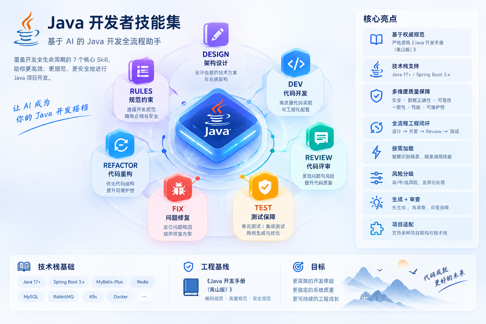

# Java Developer Skill

<div align="center">
  
  <p><strong>基于 AI 的 Java 开发全流程助手</strong></p>
</div>

> 面向 Java/Spring 后端项目的可按需加载 Skill：让代码生成、接口设计、数据库变更、代码 Review 和测试补全遵循一致的生产级约束。

[](LICENSE)
[](https://www.oracle.com/java/technologies/javase/)
[](https://spring.io/projects/spring-boot)



## 项目简介

Java Developer Skill 面向 Java/Spring 后端项目，基于《Java 开发手册（黄山版）》并补充常见工程实践。它会按任务读取相关规则，帮助完成开发、设计、Review、测试、修复、重构和规范查询；不替代项目约定或安全审查。

想查看完整的规则说明、仓库结构和维护方法，请阅读[详细版 README](README-DETAILS.md)。

## 七个入口

| 入口 | 用途 | 主要交付 |
|---|---|---|
| `/java-dev` | 写新功能 | 按项目现有写法实现接口、业务逻辑或代码骨架 |
| `/java-design` | 先做设计 | 梳理接口、表结构、事务和可能的风险 |
| `/java-review` | 检查代码 | 找出有证据的问题，并说明位置和修改建议 |
| `/java-test` | 补充测试 | 覆盖正常情况、边界和失败情况 |
| `/java-fix` | 排查问题 | 找原因，做必要的修复，并补回归测试 |
| `/java-refactor` | 整理旧代码 | 分步骤改善代码，同时尽量保持原有行为 |
| `/java-rules` | 查询规范 | 用具体例子解释规则和适用条件 |

表里的 `/java-dev` 等是入口名称，不一定是你使用的 AI 工具自带的斜杠命令。不会用这些名称也没关系，启用 Skill 后直接说清楚要做什么就行。

## 效果验证

同一批 Java/Spring 任务分别在启用和未启用 Skill 时评测，按规约逐项评分：

| **指标** | **用本 Skill** | **不用 Skill** | **提升** |
|---|---:|---:|---:|
| **平均规约通过率（holdout-v6）** | **100.00%** | 88.89% | **+11.11pp** |
| **整例通过率（holdout-v6）** | **100.00%**（15/15） | 73.33%（11/15） | **+26.67pp** |
| **最差用例平均通过率** | **100.00%** | 77.78% | **+22.22pp** |
| **平均规约通过率（eval-v9）** | **100.00%** | 91.67% | **+8.33pp** |

评测配置、用例和结果见 [`evals/`](evals/README.md)。来源任务参与过优化，因此这些数据用于回归验证，不代表独立泛化收益。

## 覆盖范围

| 领域 | 覆盖内容 |
|---|---|
| Java 基础 | 命名、日期时间、金额、集合、并发和资源释放 |
| Spring 接口 | Controller、DTO、参数校验、响应和接口兼容 |
| 数据与事务 | SQL、索引、分页、事务、幂等和数据迁移 |
| 安全与可靠性 | 权限、日志脱敏、缓存、消息、超时和重试 |
| 测试与架构 | 单元/集成测试、分层和模块边界 |

## 安装

在终端运行这条命令，就能把 Java Developer Skill 安装到 Codex：

```bash
npx skills add https://github.com/wzj1228516103/java-developer-skill -g -a codex -y
```

安装后运行下面的命令，检查它是否已经装好：

```bash
npx skills list -g -a codex
```

看到 `java-developer-skill` 就表示安装完成。重新打开 Codex，在消息里输入 `$java-developer-skill`，再接着写你的任务。若找不到它，重启 Codex 后再检查一次。

## 使用示例

启用 Skill 后，像平时一样把需求说清楚就行，不用背入口名称：

| 你可以这样说 | 它会帮你做什么 |
|---|---|
| “按这个项目现在的写法，帮我加一个创建订单的接口，写完跑相关测试。” | 先看项目已有代码和技术栈，再实现功能并验证。 |
| “帮我检查这次改动有没有权限、事务或 SQL 问题；只检查，先别改代码。” | 根据代码证据指出问题、位置和建议，不会擅自修改。 |
| “库存扣减应该怎么设计？请说明并发控制和失败后怎么处理，先给方案。” | 先梳理方案和风险，不直接开始写代码。 |
| “这个接口偶尔读到旧订单状态，帮我找原因、修复并补一个回归测试。” | 排查原因，做必要修改，再检查相关测试。 |

## 项目配置

- `memory.md` 保存个人习惯；`project/_template.md` 可复制后填写某个项目的技术栈和约定。
- 项目约定优先于个人习惯，但不能放宽安全和数据正确性要求。不要把一次性选择写成长期配置，也不要提交凭据或内部信息。

更多配置说明见 [`project/README.md`](project/README.md)。

## 适用边界

- 只对当前任务应用相关规则；Demo 和一次性脚本可以保持轻量。
- 项目已有约定优先；安全和数据正确性要求不能放宽。用户要求不使用本 Skill 时，停止应用它的规则。

本项目提供工程指导，不替代团队的安全审计、数据库审批或发布流程。

## 参考与致谢

- [**《Java 开发手册（黄山版）》**](https://github.com/alibaba/p3c) —— 本 Skill 的规约内容来源，阿里巴巴 Java 社区工程规约的集大成者；本项目只选取并重新整理相关内容。
- [Alibaba Java Development Guide](https://github.com/Sxuan-Coder/alibaba-java-development-guide) —— 参考了按需路由、规则分级和项目配置。
- [backend-skill](https://github.com/zhangloveyan/backend-skill) —— 参考了开发流程、代码模板和测试闭环。
- [**skill-up**](https://github.com/alibaba/skill-up) —— 本 Skill 的评测工具，支撑 `evals/` 基准对比与持续回归。

本项目不是阿里巴巴官方产品，也未获其背书。项目原创内容采用 [MIT License](LICENSE)；引用内容和第三方素材遵循各自许可。

## 维护与反馈

欢迎提交问题和改进建议。修改后可运行仓库中的维护检查：

```powershell
pwsh -NoProfile -File ./data/maintenance/scripts/validate-registry.ps1
pwsh -NoProfile -File ./data/maintenance/scripts/validate-content.ps1
```

版本变化见 [CHANGELOG](CHANGELOG.md)，安全问题见 [SECURITY](SECURITY.md)。
